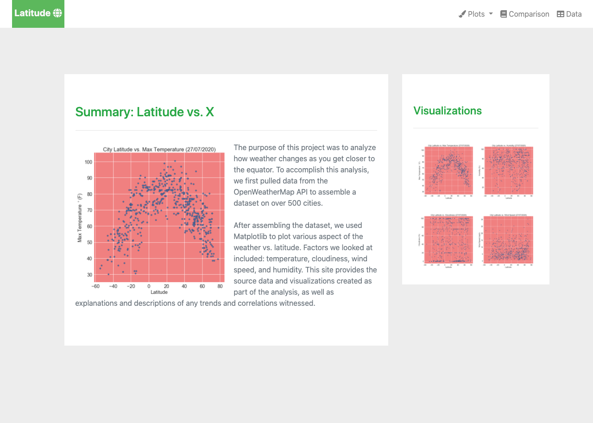
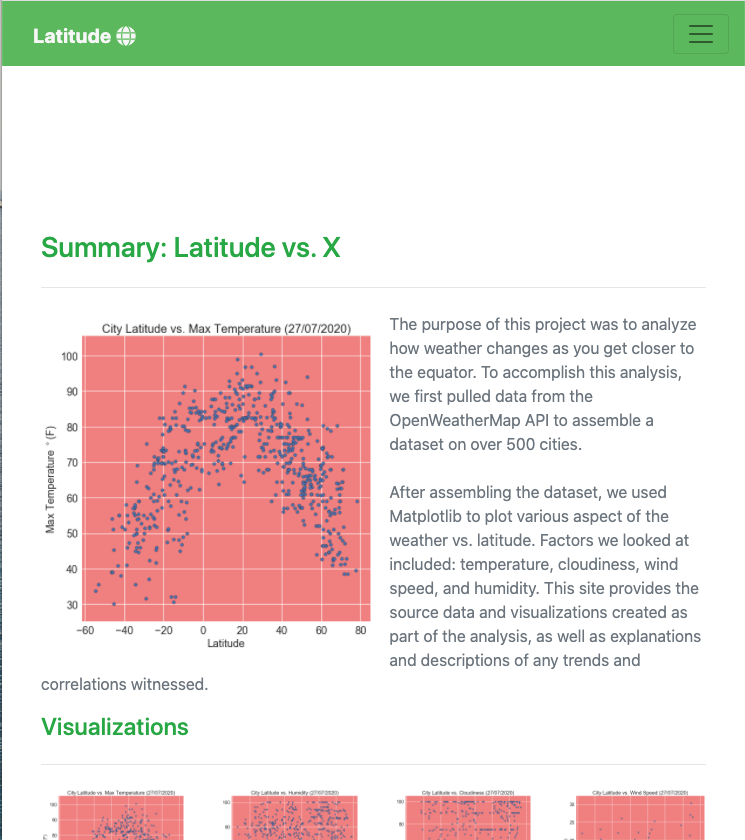
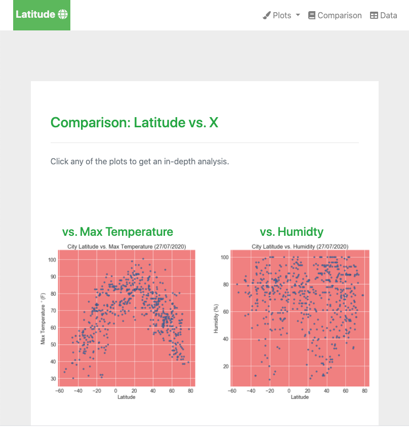
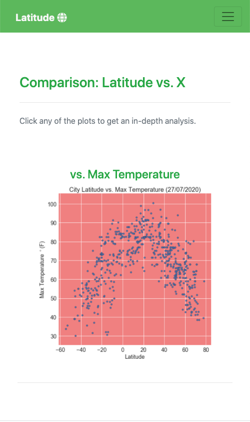
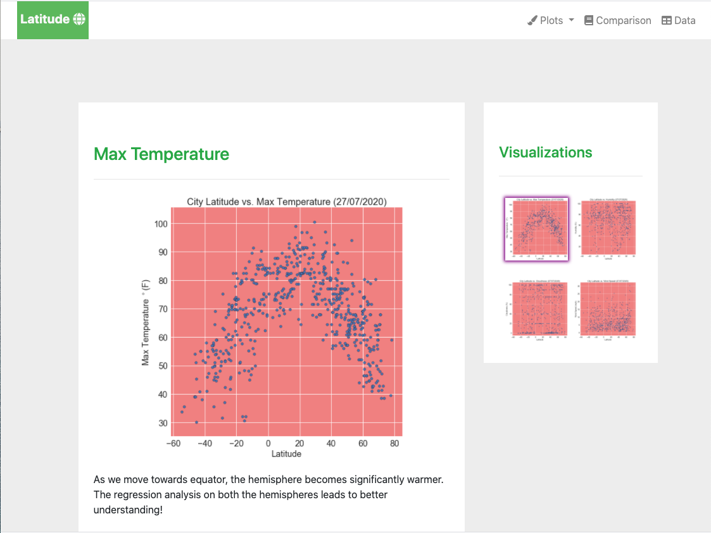
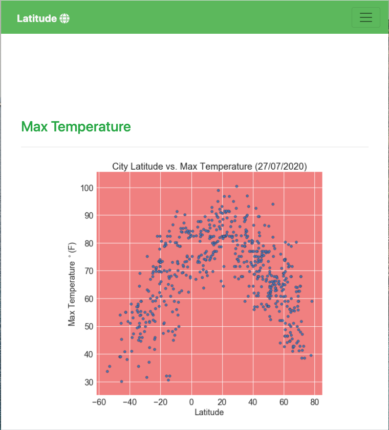

# Web Visualization Dashboard (Latitude)

## Introduction

Data is more powerful when we share it with others! In this project, a web portal is built to create a dashboard showing the results of the analysis.

The data retrieval and analysis are the same as that of [the project](https://github.com/bnarath/python-api-challenge), where we identify globally dispersed locations and the nearby cities to those locations using [citipy API](https://pypi.org/project/citipy/). Then, retrieve the weather information of those cities via [OpenWeatherMap API](https://openweathermap.org/api). This weather data is later analysed to understand the impact of latitude on various aspects of the weather. Factors we looked at included: temperature, cloudiness, wind speed, and humidity.

## Web portal is [here](https://bnarath.github.io/climate-web-app/). Check it out!!!

## Code for Data Retrieval and Visualization is [here](Code/Data_Retrieval_and_Plotting.ipynb)

## Cleaned Data used for Visualization is [here](Output/cleaned_cities_weather.csv)

## Web design

Portal has a total of 7 pages interconnected. 

- Landing page (summary of the study)
- Pages for each study (4 pages)
- Comparison page (comparison of all of the plots)
- Data page (where we can view the data used to build them)

## Website Features

The website consists of 7 pages total, including:

* A [landing page](#landing-page) containing:
  * An explanation of the project.
  * Links to each visualizations page. There should be a sidebar containing preview images of each plot, and clicking an image should take the user to that visualization.
 
  
* Four [visualization pages](#visualization-pages), each with:
  * A descriptive title and heading tag.
  * The plot/visualization itself for the selected comparison.
  * A paragraph describing the plot and its significance.
  
* A ["Comparisons" page](#comparisons-page) that:
  * Contains all of the visualizations on the same page so we can easily visually compare them.
  * Uses a Bootstrap grid for the visualizations.
    * The grid must be two visualizations across on screens medium and larger (768px and above), and 1 across on extra-small and small screens.
    
* A ["Data" page](#data-page) that:
  * Displays a responsive table containing the data used in the visualizations.
    * The table must be a bootstrap table component. (https://getbootstrap.com/docs/4.3/content/tables/#responsive-tables)
    * The dataframe is converted to HTML using pandas DF.to_html(). See the documentation [here](https://pandas.pydata.org/pandas-docs/version/0.17.0/generated/pandas.DataFrame.to_html.html)

* The website, at the top of every page, have a navigation menu that:
  * Has the name of the site on the left of the nav which allows users to return to the landing page from any page.
  * Contains a dropdown menu on the right of the navbar named "Plots" that provides a link to each individual visualization page.
  * Provides two more text links on the right: "Comparisons," which links to the comparisons page, and "Data," which links to the data page.
  * Is responsive (using media queries), the nav have different behavior on small screens (< 768px) as in ["Navigation Menu" section](#navigation-menu) (notice the background color change).

* The website is deployed to GitHub pages.

* Glyphicons next to links in the header are from [fontawesome.com](https://fontawesome.com/)

* Visualization navigation on every visualizations page has an active state

### Screenshots

This section contains screenshots of each page built, at varying screen widths. 

#### Landing page

Large screen Vs Small Screen:

  
   

#### Comparisons page

Large screen Vs Small Screen:

  
   

#### Data page

Large screen Vs Small Screen:

  
   

#### Visualization pages

Large screen:

Small screen:

#### Navigation menu

Large screen:

Small screen:

